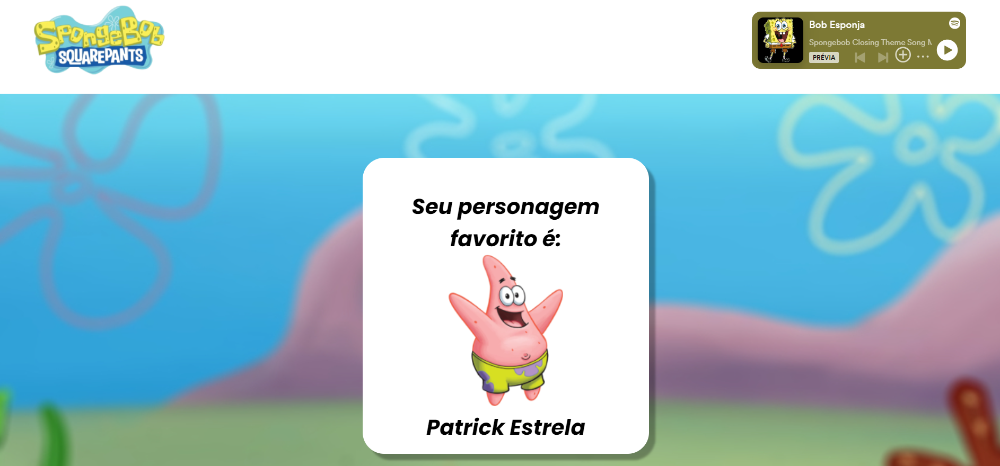

# React + Vite

This template provides a minimal setup to get React working in Vite with HMR and some ESLint rules.

Currently, two official plugins are available:

- [@vitejs/plugin-react](https://github.com/vitejs/vite-plugin-react/blob/main/packages/plugin-react/README.md) uses [Babel](https://babeljs.io/) for Fast Refresh
- [@vitejs/plugin-react-swc](https://github.com/vitejs/vite-plugin-react-swc) uses [SWC](https://swc.rs/) for Fast Refresh

<h2> Bob Esponja </h2>

 Esse projeto foi feito para você visualizar informações dos principais personagens do desenho animado Bob Esponja, e também te proporciona a possibilidade de escolher seu personagem favorito. Além disso, a melhor parte é: você pode ouvir musicas do seriado 😎

<h3> Tecnologias </h3>

 <strong> Front-End: </strong> React, CSS 

 <strong> Back-End: </strong> NodeJs, Express, MongoDB 

<h2> Project preview </h2>
    

